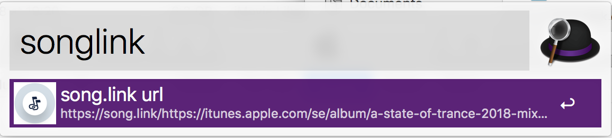

# song.link url creator workflow for alfredapp

Creates music sharing links for [song.link](https://song.link) so that your friends gets links for whatever music platform they are using.

## Usage

Copy a songlink url from your musicplayer and run the workflow. Press enter to copy the song.link url to the clipboard or CMD-Enter to open it in your default browser.

## Demo

